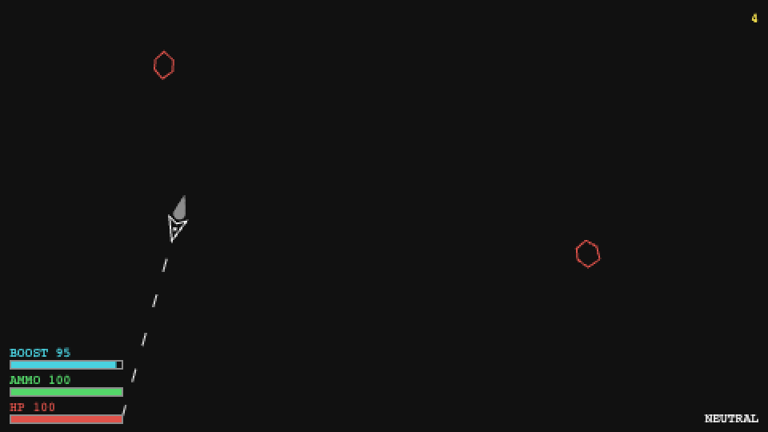

# BYTEPATH-JS

A browser arcade shooter in vanilla TypeScript + Canvas 2D — a port of [BYTEPATH](https://github.com/a327ex/BYTEPATH) by [a327ex](https://github.com/a327ex), originally built in Lua/LÖVE.

**▶ Play it now: [izabela-am.github.io/bytepath-js](https://izabela-am.github.io/bytepath-js/)**



## The game

You pilot a Ship in constant forward motion — you never stop, you only steer. Survive as long as you can while the Director escalates enemy pressure every 22 seconds. There is no win condition: every Run ends in death and yields a Score.

- **Ammo** is consumed by firing and replenished by pickups. Run dry and your Attack reverts to Neutral.
- **Boost** is a draining/regenerating meter — spend it to speed up or brake, but deplete it and it needs a cooldown.
- **Attack pickups** swap your current Attack (Double, Spread, ...). You hold exactly one at a time.

## Controls

| Key | Action |
|-----|--------|
| ← → | Steer |
| ↑ | Boost (faster) |
| ↓ | Brake (slower) |
| M | Mute sound |

Firing is automatic. Keyboard required — desktop only for now.

## Tech

No game engine, no rendering library — by design. The visuals are pure geometry and the physics is circle-overlap collision, so the whole game runs on a hand-rolled fixed-timestep loop, timer/tween module, and a plain Canvas 2D context at an internal 480×270 resolution with pixelated upscale.

- **TypeScript** (strict) + **Vite**
- **Canvas 2D** rendering behind a swappable draw boundary
- **WebAudio-synthesized** retro SFX — zero audio assets
- **Vitest** unit tests on the rules code (resource math, Director schedule, collision, Score)

## Development

```sh
npm install
npm run dev      # dev server
npm test         # vitest
npm run build    # production build to dist/
```

Pushes to `master` run the test suite and deploy to GitHub Pages automatically.
